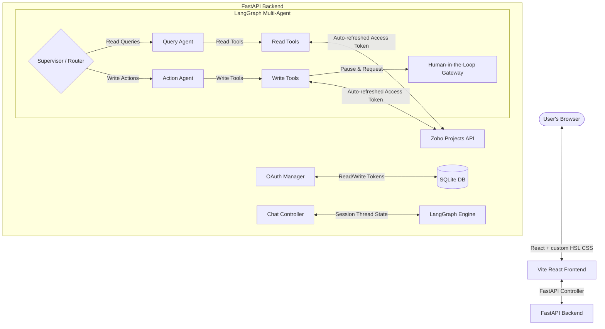

# AI-Powered Zoho Projects Chatbot

A state-of-the-art, conversational AI assistant that connects to Zoho Projects via its REST API (specifically tailored for the **Zoho India Region**). Users authenticate with their own Zoho accounts via a secure OAuth 2.0 flow, interacting with a stateful multi-agent LangGraph system running on FastAPI and a premium, responsive glassmorphic React frontend.

---

## Key Features

1. **User-Based OAuth 2.0 Authentication**: Pure authorization code flow (offline access) with silent automatic access token refreshing and dynamic portal detection. No shared secrets.
2. **Multi-Agent LangGraph Architecture**:
   - **Supervisor/Router**: High-speed Groq-powered classifier that evaluates query intents.
   - **Query Agent (Read Specialist)**: Dedicated read specialist with 5 read-only tools to fetch projects, tasks, members, and aggregation reports.
   - **Action Agent (Write Specialist)**: Handles task creations, updates, and deletions.
3. **Human-in-the-Loop (HIL) Gate**: Intercepts all write operations (create, update, delete) inside the Graph state, pauses execution, pops up a secure decision dialog in the React UI, and executes only upon explicit confirmation.
4. **Hybrid Memory Pipeline**:
   - *Short-Term Memory*: Persists thread context (such as the active project under discussion) across chat turns.
   - *Long-Term Memory*: Persists user preferences and last-accessed project records in a secure SQLite store, dynamically injecting them into subsequent login greeting contexts.

---

## Architectural Topology



---

## 8 Integrated Agent Tools

| # | Tool Name | Scope / Access | Description |
| :--- | :--- | :--- | :--- |
| 1 | `list_projects` | Read | Lists all active Zoho projects for the logged-in user. |
| 2 | `list_tasks` | Read | Lists tasks under a project with filters (status, assignee, due date). |
| 3 | `get_task_details` | Read | Fetches comprehensive details of a single task by its ID. |
| 4 | `create_task` | Write (HIL) | Creates a new task in a project (requires user approval). |
| 5 | `update_task` | Write (HIL) | Modifies task status, priority, due date, or assignee (requires user approval). |
| 6 | `delete_task` | Write (HIL) | Permanently deletes a task by its ID (requires user approval). |
| 7 | `list_project_members` | Read | Retrieves all members and owner roles within the project. |
| 8 | `get_task_utilisation` | Read | Aggregates and summarizes task loads per member across a project. |

---

## Setup & Running Guide

### Prerequisites
- Python 3.10+ installed
- Node.js 18+ installed

### Step 1: Clone and Configure Environment

1. Rename `.env.example` in the root of the project to `.env`:
   ```bash
   cp .env.example .env
   ```
2. Populate the `.env` file with your credentials (see the **OAuth Configuration Guide** below).

### Step 2: Set Up and Run Backend API

1. Navigate to the root directory and create a Python virtual environment:
   ```bash
   python -m venv .venv
   ```
2. Activate the virtual environment:
   - **Windows (PowerShell)**: `.venv\Scripts\Activate.ps1`
   - **macOS/Linux**: `source .venv/bin/activate`
3. Install dependencies:
   ```bash
   pip install -r backend/requirements.txt
   ```
4. Run the database migrations (verifies database creation):
   ```bash
   python -c "import asyncio; from backend.app.db.database import init_db; asyncio.run(init_db())"
   ```
5. Run the FastAPI development server:
   ```bash
   uvicorn backend.app.main:app --reload --port 8000
   ```
   *The Swagger API documentation will be available at `http://localhost:8000/docs`.*

### Step 3: Set Up and Run React Frontend

1. Navigate to the `frontend` directory:
   ```bash
   cd frontend
   ```
2. Install npm dependencies:
   ```bash
   npm install
   ```
3. Start the Vite development server:
   ```bash
   npm run dev
   ```
4. Open **`http://localhost:5173/`** in your browser to experience the chatbot!

---

## OAuth Configuration Guide (Zoho India Region)

To connect your chatbot to Zoho Projects API in the Indian region, follow these steps to register your Server-Based application:

1. Navigate to the **Zoho India API Console**: [https://api-console.zoho.in/](https://api-console.zoho.in/)
2. Log in with your Zoho India account.
3. Click on **Add Client** and select **Server-based Applications**.
4. Configure the application details:
   - **Client Name**: `Zoho Projects AI Assistant`
   - **Homepage URL**: `http://localhost:8000`
   - **Authorized Redirect URIs**: `http://localhost:8000/auth/callback` *(Must match exactly!)*
5. Click **Create** and retrieve your **Client ID** and **Client Secret**.
6. Place these retrieved credentials directly into your root `.env` file:
   ```ini
   ZOHO_CLIENT_ID=1000.XXXXXXXXXXXXXXXXXXXXXXXX
   ZOHO_CLIENT_SECRET=XXXXXXXXXXXXXXXXXXXXXXXXXXXXXXXXXXXXXXXX
   ZOHO_REDIRECT_URI=http://localhost:8000/auth/callback
   ZOHO_DOMAIN=zoho.in
   ```

---

## Known Limitations

- **Zoho Portals**: The Zoho Projects API operates hierarchically under a `portal_id`. If a user belongs to multiple portals, the client defaults to selecting the first active portal.
- **In-Memory Checkpointing**: Short-term conversational state memory utilizes LangGraph's in-memory `MemorySaver`. Restarting the FastAPI server will wipe short-term memory histories, while long-term preference memory (persisted in SQLite) will remain safe.
- **Offline Refresh Token**: In production, Zoho only sends a `refresh_token` during the *very first* OAuth consent approval. Subsequent logins by the same user will omit the refresh token. We force `prompt=consent` to guarantee a fresh token exchange, but in enterprise settings, database credential synchronization is recommended.


